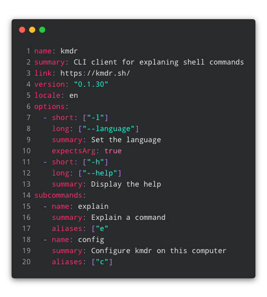

# Kmdr Schema Parser/Validator

> A parser/validator for kmdr specs in YAML or JSON format

<p align="center">
  
</p>

## Installation

### With `npm`

```bash
npm install kmdr-parser
```

### With `yarn`

```bash
yarn add kmdr-parser
```

## Usage

### CLI

```bash
$ kmdr-parser --file kmdr.yaml
```

### API

```js
import Schema from "kmdr-parser";

const schema = {
  name: "kmdr",
  summary: "The CLI tool for explaining shell commands from your terminal"
};

try {
  const kmdrSchema = new Schema(schema);
} catch (err) {
  console.error(err);
}
```

## Schema

Every program explained by kmdr has a schema with key-value pairs defining the properties of commands.

| Key             | Definition                                                                | Required | Type            | Default |
| --------------- | ------------------------------------------------------------------------- | -------- | --------------- | ------- |
| `name`          | The name of the program or subcommand                                     | Yes      | `string`        |         |
| `summary`       | A short explanation of what the program                                   | Yes      | `string`        |         |
| `description`   | A verbose explanation of what the program does                            | No       | `string`        |         |
| `version`       | The version of the program used for building this schema                  | No       | `string`        |         |
| `locale`        | The target language of the schema                                         | No       | `string`        | `"en"`  |
| `subcommands`   | The subcommands available in the program                                  | No       | `subcommands[]` | `[]`    |
| `options`       | The options available in the program                                      | No       | `options[]`     | `[]`    |
| `link`          | Link to the program's page                                                | No       | `string`        |         |
| `stickyOptions` | Whether the program accepts sticky options (e.g. `-rf` for `-r` and `-f`) | No       | `boolean`       | false   |
| `environment`   | Environment variables picked up by the program                            | No       | `environment[]` | `[]`    |
| `examples`      |                                                                           | Non      | `examples[]`    | `[]`    |

### Option Object

| Key           | Definition                                              | Required                  | Type       | Default |
| ------------- | ------------------------------------------------------- | ------------------------- | ---------- | ------- |
| `long`        | The long format of the option (e.g. `--file`)           | No if `short` is provided | `string[]` | `[]`    |
| `short`       | The short format of the option (e.g. `-f` for `--file`) | No if `long` is provided  | `string[]` | `[]`    |
| `summary`     | A short explanation of the option                       | Yes                       | `string`   |         |
| `description` | A verbose explanation of the option                     | No                        | `string`   |         |
| `expectsArg`  | Whether the option expects an argument or not           | No                        | `boolean`  | `false` |
| `defaultArg`  | Default value if argument is missing                    | No                        | `string`   |         |

### Subcommand Object

A programs subcommands encapsulate specialized tasks that a program can do. Subcommands usually follow immediately after the program name in a command. Some examples are:

- `npm uninstall`: `remove` is a sub command of the program `npm`
- `yarn install`: `install` is a sub command of the program `yarn`
- `docker images`: `images` is a sub command of `docker`
- `git commit`: `commit` is a sub command of `docker`

A subcommand can have 0 or more subcommands available for execution:

- `docker network create`: `docker` has a subcommand `network` and `network` has a subcommand `create`
- `git submodule add`: `git` has a subcommand `submodule` and `submodule` has a subcommand `add`

Subcommands have similar key-value pairs to programs. In Table 2.0 we see that there are some new key-value pairs and different key-value pairs are marked as required when compared to the program key-value pair set.

| Key           | Definition                                  | Required | Type            | Default |
| ------------- | ------------------------------------------- | -------- | --------------- | ------- |
| `name`        | The name of the program or subcommand       | **Yes**  | `string`        |         |
| `summary`     | A short explanation of the subcommand       | **Yes**  | `string`        |         |
| `aliases`     | Aliases                                     | No       | `string`        |         |
| `description` | A verbose explanation of the subcommand     | No       | `string`        |         |
| `subcommands` | The subcommands available in the subcommand | No       | `subcommands[]` | `[]`    |
| `options`     | The options available in the subcommand     | No       | `options[]`     | `[]`    |

### Environment Object

| Key       | Definition                                      | Required | Type     | Default |
| --------- | ----------------------------------------------- | -------- | -------- | ------- |
| `name`    | The name of the environment variable            | **Yes**  | `string` |         |
| `summary` | A short explanation of the environment variable | **Yes**  | `string` |         |
